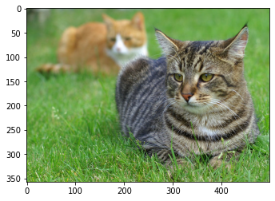
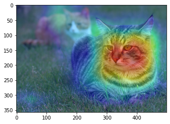
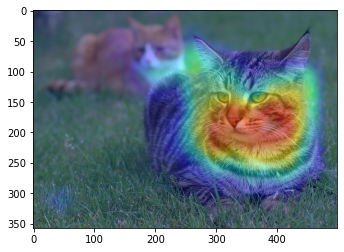

# Basic Tutorial on Interpreters in TorchFlare
* We will use GradCam and GradCam++ algorithms to visualize what model sees.
* We will use an image of tigercat for our example.
***

#### Importing Libraries
``` python
import torch

from torchflare.interpreters import GradCam, GradCamPP, visualize_cam

from PIL import Image
import torchvision
import torchvision.transforms as transforms
import numpy as np
import matplotlib.pyplot as plt

%matplotlib inline
```


``` python
%load_ext nb_black
```


#### Transforms and Reading the image
``` python
# Some transforms.
normalize = transforms.Normalize(mean=[0.485, 0.456, 0.406], std=[0.229, 0.224, 0.225])

preprocess = transforms.Compose([transforms.ToTensor(), normalize])

# We use PIL to open image
image = Image.open("tigercat.jpg")
# convert image to tensor
tensor = preprocess(image)

# reshape 4D tensor (N, C, H, W)
tensor = tensor.unsqueeze(0)
image = np.array(image)
```


``` python
plt.imshow(image)
```





#### Defining the model and the target layer.
* We are using Resnet18 for our experiment here.
``` python
model = torchvision.models.resnet18(pretrained=True)
target_layer = model.layer4[1].conv2
```

#### Interpretation using GradCam algorithm
* Note: Tigercat has label 282 in imagenet dataset.
``` python
cam_model = GradCam(model=model, target_layer=target_layer)
cam = cam_model(tensor, target_category=282)
visualize_cam(image=image, cam=cam)
```





#### Interpretation using GradCam++ algorithm.
``` python
cam_model = GradCamPP(model=model, target_layer=target_layer)
campp = cam_model(tensor, target_category=282)
visualize_cam(image=image, cam=campp)
```



