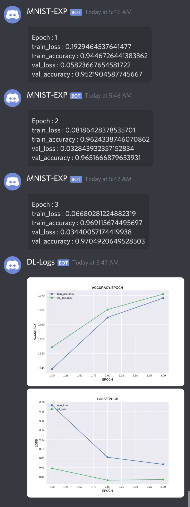

# Image Classification on MNIST
* We will explore fit method and an interesting callback called DiscordNotifierCallback which will send epoch metrics and history plots to our personal discord server.

***
#### Importing Libraries
``` python
import pandas as pd
import numpy as np
from torchflare.experiments import Experiment
import torchflare.callbacks as cbs
import torchflare.metrics as metrics
from sklearn.model_selection import train_test_split
import os

import torch
import torch.nn as nn
import torch.nn.functional as F
```


#### Reading data and preprocessing.
``` python
train_df = pd.read_csv("dataset/train.csv")
```


``` python
classes = train_df.label.nunique()
```


``` python
train_labels = train_df['label'].values
train_images = (train_df.iloc[:,1:].values).astype('float32')
train_images, val_images, train_labels, val_labels = train_test_split(train_images, train_labels,
                                                                     stratify=train_labels, random_state=123,
                                                                     test_size=0.20)


```


``` python
train_images = train_images.reshape(train_images.shape[0],1, 28, 28)
val_images = val_images.reshape(val_images.shape[0], 1,28, 28)
```


``` python
train_images = train_images / 255.0
val_images = val_images/255.0
```

#### Defining Network architecture.
``` python
class Net(torch.nn.Module):
    def __init__(self):
        super(Net, self).__init__()

        self.conv1 = nn.Sequential(
            nn.Conv2d(in_channels=1, out_channels=64, kernel_size=3, padding=1),
            nn.BatchNorm2d(num_features=64, eps=1e-05, momentum=0.1),
            nn.Conv2d(in_channels=64, out_channels=64, kernel_size=3, padding=1),
            nn.BatchNorm2d(num_features=64, eps=1e-05, momentum=0.1),
            nn.ReLU(),

            nn.Conv2d(in_channels=64, out_channels=64, kernel_size=3, padding=1),
            nn.BatchNorm2d(num_features=64, eps=1e-05, momentum=0.1),
            nn.Conv2d(in_channels=64, out_channels=64, kernel_size=3, padding=1),
            nn.BatchNorm2d(num_features=64, eps=1e-05, momentum=0.1),
            nn.ReLU(),

            nn.MaxPool2d(kernel_size=2, stride=2),
            nn.Dropout2d(0.25),
        )

        self.conv2 = nn.Sequential(
            nn.Conv2d(in_channels=64, out_channels=64, kernel_size=3, padding=1),
            nn.BatchNorm2d(num_features=64, eps=1e-05, momentum=0.1),
            nn.ReLU(),

            nn.Conv2d(in_channels=64, out_channels=64, kernel_size=3, padding=1),
            nn.BatchNorm2d(num_features=64, eps=1e-05, momentum=0.1),
            nn.ReLU(),

            nn.MaxPool2d(kernel_size=2, stride=2),
            nn.Dropout2d(0.25),
        )

        self.fc1 = nn.Sequential(
            nn.Dropout(0.25),
            nn.Linear(7 * 7 * 64, 256),
            nn.BatchNorm1d(num_features=256, eps=1e-05, momentum=0.1),
            nn.ReLU(),
            nn.Dropout(0.25),
        )

        self.fc2 = nn.Sequential(
            nn.Dropout(0.25),
            nn.Linear(256, 10),
        )

    def forward(self, x):
        x = self.conv1(x)
        x = self.conv2(x)

        # Flatten the 3 last dimensions (channels, width, height) to one
        x = x.view(x.size(0), x.size(1) * x.size(2) * x.size(3))

        x = self.fc1(x)
        x = self.fc2(x)

        return x
```


#### Defining metrics and callbacks.
``` python
metric_list = [metrics.Accuracy(num_classes=classes, multilabel=False)]

callbacks = [
    cbs.EarlyStopping(monitor="accuracy", mode = "max",patience=5),
    cbs.ModelCheckpoint(monitor="accuracy", mode = "max"),
    cbs.ReduceLROnPlateau(mode="max" , patience = 2),
    cbs.DiscordNotifierCallback(exp_name = "MNIST-EXP" , webhook_url = os.environ.get("DISCORD_WEBHOOK") ,
                               send_figures = True)

]
```

#### Defining, compiling the experiment.
``` python
exp = Experiment(
    num_epochs=3,
    fp16=True,
    device="cuda",
    seed=42,
)
exp.compile_experiment(
    model=Net(),
    optimizer="Adam",
    optimizer_params=dict(lr=1e-3),
    callbacks=callbacks,
    criterion="cross_entropy",
    metrics=metric_list,
    main_metric="accuracy",
)
```

#### Using the fit method to train our model.
``` python
exp.fit(x = train_images , y = train_labels , val_data = (val_images , val_labels), batch_size = 32)
```


    Epoch: 1/3
    Train: 1050/1050 [=========================]- 25s 24ms/step - train_loss: 0.1929 - train_accuracy: 0.9447
    Valid: 263/263 [=========================]- 1s 5ms/step - val_loss: 0.0582 - val_accuracy: 0.9522

    Epoch: 2/3
    Train: 1050/1050 [=========================]- 25s 23ms/step - train_loss: 0.0819 - train_accuracy: 0.9624
    Valid: 263/263 [=========================]- 1s 6ms/step - val_loss: 0.0328 - val_accuracy: 0.9652

    Epoch: 3/3
    Train: 1050/1050 [=========================]- 25s 24ms/step - train_loss: 0.0668 - train_accuracy: 0.9691
    Valid: 263/263 [=========================]- 2s 7ms/step - val_loss: 0.0344 - val_accuracy: 0.9705


#### Here is a screenshot of how the progress on discord server looks like.


