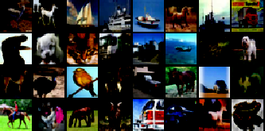
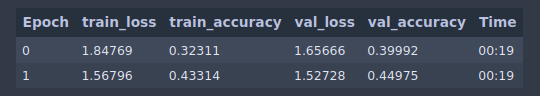

# Image Classification Tutorial

Hey there, this tutorial will guide on how to do image classification using torchflare.

Dataset: https://www.kaggle.com/c/cifar-10
* ### Importing Libraries
``` python
import numpy as np
import pandas as pd
import albumentations as A
from sklearn.model_selection import train_test_split

import torch.nn as nn
import torch.nn.functional as F
import torchvision.transforms as transforms

from torchflare.datasets import SimpleDataloader, show_batch
from torchflare.experiments import Experiment
import torchflare.callbacks as cbs
from torchflare.metrics import Accuracy
```

* ### Loading and Preparing the dataset

``` python
df = pd.read_csv("trainLabels.csv")
classes = df.label.unique().tolist()
class_to_idx = {value: key for key, value in enumerate(classes)}
df.label = df.label.map(class_to_idx)
df.id = df.id.astype(str)
df = df.sample(frac=1).reset_index(drop=True)  # Shuffling the dataframe

test_df = df.iloc[:10000, :]  # I took first 10000 entries as test data
data_df = df.iloc[10000:, :]
train_df, valid_df = train_test_split(
    data_df, test_size=0.3
)  # Splitting into train and validation data.
```

* ### Defining a Simple Model.
``` python
class Net(nn.Module):
    def __init__(self):
        super(Net, self).__init__()
        self.conv1 = nn.Conv2d(3, 6, 5)
        self.pool = nn.MaxPool2d(2, 2)
        self.conv2 = nn.Conv2d(6, 16, 5)
        self.fc1 = nn.Linear(16 * 5 * 5, 120)
        self.fc2 = nn.Linear(120, 84)
        self.fc3 = nn.Linear(84, 10)

    def forward(self, x):
        x = self.pool(F.relu(self.conv1(x)))
        x = self.pool(F.relu(self.conv2(x)))
        x = x.view(-1, 16 * 5 * 5)
        x = F.relu(self.fc1(x))
        x = F.relu(self.fc2(x))
        x = self.fc3(x)
        return x


net = Net()
```
* ### Defining basic transforms.
``` python
train_transform = transforms.Compose(
    [transforms.ToTensor(), transforms.Normalize((0.5, 0.5, 0.5), (0.5, 0.5, 0.5))]
)

valid_transform = transforms.Compose([transforms.ToTensor()])
```
* ### Creating Dataloaders

We will be using SimpleDataloaders from torchflare to easily create the dataloaders.
``` python
# Creating Training Dataloader.

train_dl = SimpleDataloader.image_data_from_df(
    path="./train",
    image_col="id",
    label_cols="label",
    augmentations=train_transform,
    df=train_df,
    extension=".png",
    convert_mode="RGB",
).get_loader(batch_size=32, shuffle=True, num_workers = 0)

# Creating Validation Dataloader.

valid_dl = SimpleDataloader.image_data_from_df(
    path="./train",
    image_col="id",
    label_cols="label",
    augmentations=valid_transform,
    df=valid_df,
    extension=".png",
    convert_mode="RGB",
).get_loader(batch_size=16, num_workers=0)

# Creating Test Dataloader.

test_dl = SimpleDataloader.image_data_from_df(
    path="./train",
    image_col="id",
    label_cols=None,  # Setting label_cols as None since we wont have labels for test data.
    augmentations=valid_transform,
    df=test_df,
    extension=".png",
    convert_mode="RGB",
).get_loader(batch_size=16, num_workers=0)
```

Visualizing a batch from train dataloader.
``` python
show_batch(train_dl)
```


* ### Defining Callbacks and metrics.

We will be using callbacks and metrics defined in torchflare library.

``` python
metric_list = [Accuracy(num_classes=len(classes), multilabel=False)]

callbacks = [
    cbs.EarlyStopping(monitor=acc.handle(), patience=5),
    cbs.ModelCheckpoint(monitor=acc.handle()),
]
```

* ### Setting up the experiment and Training our model.
***
**1. The first step is to setup some constants and params for the experiment.**

``` python
exp = Experiment(
    num_epochs=5,
    save_dir="./models",
    model_name="cifar10.bin",
    fp16=False,
    using_batch_mixers=False,
    device="cuda",
    compute_train_metrics=True,
    seed=42,
)
```

**2. We will compile our experiment where we will define our optimizer, scheduler,etc**

``` python
exp.compile_experiment(
    model=net,
    optimizer="Adam",
    optimizer_params=dict(lr=3e-4),
    callbacks=callbacks,
    scheduler="ReduceLROnPlateau",
    scheduler_params=dict(mode="max", patience=5),
    criterion="cross_entropy",
    metrics=metric_list,
    main_metric="accuracy",
)
```

**3. This step is optional but its good to perform a check to see if the
       defined model's forward pass is working or not and check if loss computation
       is working.**

``` python
exp.perform_sanity_check(train_dl)
```


**4. Now we run our experiment with our training and validation dataloaders. We use fastprogress as our progress bar hence the output will be like fast.ai,
       a nice table with our metrics, loss and time.**

``` python
exp.run_experiment(train_dl=train_dl, valid_dl=valid_dl)
```


**5. The infer method yields output of every batch so that you can perform any kind of post-processing
           on your outputs.**

``` python
ops = []
# Since infer method yeilds we use a for loop.
for op in exp.infer(path="./models/cifar10.bin", test_loader=test_dl):
    op = post_process_func(op)
    ops.extend(y_pred)
```

**6. Want to visualize model history ?**

``` python
# I want to visualize train_accuracy/valid_accuracy against epochs.
exp.plot_history(key = "accuracy" , save_fig = False)
```
