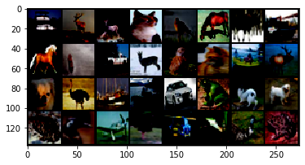
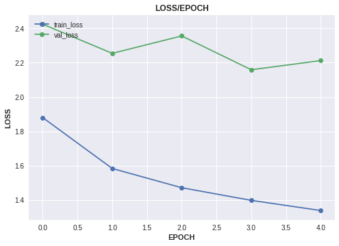
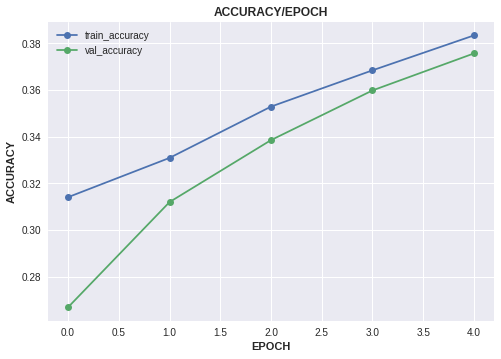

# Image Classification on CIFAR-10
* Dataset : <https://www.kaggle.com/c/cifar-10>

***
#### Importing Libraries
``` python
import torch
from torchflare.datasets import ImageDataloader , show_batch
import torchflare.callbacks as cbs
import pandas as pd

from sklearn.model_selection import train_test_split
import torch.nn as nn
import torch.nn.functional as F
import torchvision.models as models
import torchvision.transforms as transforms
from torchflare.experiments import Experiment
import torchflare.metrics as metrics
```

``` python
%load_ext nb_black
```


#### Reading data and preprocessing.
``` python
df = pd.read_csv("dataset/trainLabels.csv")
classes = df.label.unique().tolist()
class_to_idx = {value: key for key, value in enumerate(classes)}
df.label = df.label.map(class_to_idx)
df.id = df.id.astype(str)
df = df.sample(frac=1).reset_index(drop=True)
```


#### Splitting data into train and validation
``` python
test_df = df.iloc[:10000, :]  # I took first 10000 entries as test data
data_df = df.iloc[10000:, :]
train_df, valid_df = train_test_split(data_df, test_size=0.3)
```


#### Defining augmentations
``` python
train_transform = transforms.Compose(
    [
        transforms.ToTensor(),
        transforms.Normalize((0.5, 0.5, 0.5), (0.5, 0.5, 0.5)),
    ]
)

valid_transform = transforms.Compose([transforms.ToTensor()])
```


#### Creating Training, validation and Test dataloaders.
``` python
# Creating Training Dataloader.

train_dl = ImageDataloader.from_df(
    path="dataset/train",
    image_col="id",
    label_cols="label",
    augmentations=train_transform,
    df=train_df,
    extension=".png",
    convert_mode="RGB",
).get_loader(batch_size=32, shuffle=True, num_workers = 0)

# Creating Validation Dataloader.

valid_dl = ImageDataloader.from_df(
    path="dataset/train",
    image_col="id",
    label_cols="label",
    augmentations=valid_transform,
    df=valid_df,
    extension=".png",
    convert_mode="RGB",
).get_loader(batch_size=32, shuffle = False,num_workers=0)

# Creating Test Dataloader.

test_dl = ImageDataloader.from_df(
    path="dataset/train",
    image_col="id",
    label_cols=None,  # Setting label_cols as None since we wont have labels for test data.
    augmentations=valid_transform,
    df=test_df,
    extension=".png",
    convert_mode="RGB",
).get_loader(batch_size=16, num_workers=0)

```

#### Visualizing batch of training data.
``` python
show_batch(train_dl)
```

    Clipping input data to the valid range for imshow with RGB data ([0..1] for floats or [0..255] for integers).





#### Defining Network architecture.

``` python
class Net(nn.Module):
    def __init__(self):
        super().__init__()
        self.conv1 = nn.Conv2d(3, 6, 5)
        self.pool = nn.MaxPool2d(2, 2)
        self.conv2 = nn.Conv2d(6, 16, 5)
        self.fc1 = nn.Linear(16 * 5 * 5, 120)
        self.fc2 = nn.Linear(120, 84)
        self.fc3 = nn.Linear(84, 10)

    def forward(self, x):
        x = self.pool(F.relu(self.conv1(x)))
        x = self.pool(F.relu(self.conv2(x)))
        x = x.view(-1, 16 * 5 * 5)
        x = F.relu(self.fc1(x))
        x = F.relu(self.fc2(x))
        x = self.fc3(x)
        return x


net = Net()
```


#### Defining metrics and callbacks.
``` python

metric_list = [metrics.Accuracy(num_classes=len(classes), multilabel=False)]

callbacks = [
    cbs.EarlyStopping(monitor="accuracy", mode = "max",patience=5),
    cbs.ModelCheckpoint(monitor="accuracy", mode = "max"),
    cbs.ReduceLROnPlateau(mode="max" , patience = 2)
]

```


### Defining, compiling and running the experiment.
``` python
exp = Experiment(
    num_epochs=5,
    save_dir="./models",
    model_name="cifar10.bin",
    fp16=True,
    device="cuda",
    compute_train_metrics=True,
    seed=42,
)
exp.compile_experiment(
    model=net,
    optimizer="Adam",
    optimizer_params=dict(lr=3e-4),
    callbacks=callbacks,
    criterion="cross_entropy",
    metrics=metric_list,
    main_metric="accuracy",
)
exp.run_experiment(train_dl=train_dl, valid_dl=valid_dl)


```


    Epoch: 1/5
    Train: 875/875 [=========================]- 139s 159ms/step - train_loss: 1.8800 - train_accuracy: 0.3141
    Valid: 375/375 [=========================]- 47s 124ms/step - val_loss: 2.4238 - val_accuracy: 0.2670

    Epoch: 2/5
    Train: 875/875 [=========================]- 11s 13ms/step - train_loss: 1.5838 - train_accuracy: 0.3309
    Valid: 375/375 [=========================]- 3s 8ms/step - val_loss: 2.2545 - val_accuracy: 0.3120

    Epoch: 3/5
    Train: 875/875 [=========================]- 11s 13ms/step - train_loss: 1.4719 - train_accuracy: 0.3528
    Valid: 375/375 [=========================]- 3s 8ms/step - val_loss: 2.3558 - val_accuracy: 0.3385

    Epoch: 4/5
    Train: 875/875 [=========================]- 12s 13ms/step - train_loss: 1.3983 - train_accuracy: 0.3684
    Valid: 375/375 [=========================]- 3s 8ms/step - val_loss: 2.1588 - val_accuracy: 0.3598

    Epoch: 5/5
    Train: 875/875 [=========================]- 12s 14ms/step - train_loss: 1.3391 - train_accuracy: 0.3833
    Valid: 375/375 [=========================]- 3s 9ms/step - val_loss: 2.2122 - val_accuracy: 0.3756


#### Plotting experiment history.
``` python
keys = ["loss", "accuracy"]
exp.plot_history(keys=keys, plot_fig=True, save_fig=False)
```






