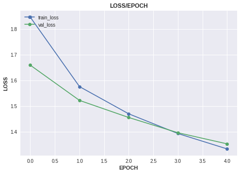
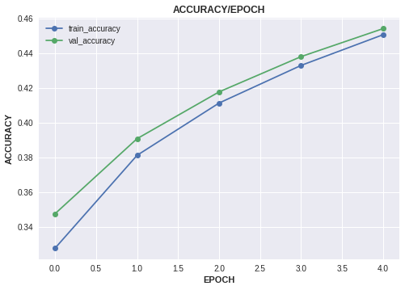

# Image Classification on CIFAR-10 with Hydra and TorchFlare
* Dataset : <https://www.kaggle.com/c/cifar-10>
* Hydra:cc : <https://github.com/facebookresearch/hydra>

We will use Hydra:cc and yaml file to manage our parameters for easy usage.
***

``` python
from hydra.experimental import compose, initialize
from omegaconf import OmegaConf
from hydra.utils import *

import torch
from torchflare.datasets import ImageDataloader , show_batch
import torchflare.callbacks as cbs
import pandas as pd

from sklearn.model_selection import train_test_split
import torch.nn as nn
import torch.nn.functional as F
import torchvision.models as models
import torchvision.transforms as transforms
from torchflare.experiments import Experiment
```


``` python
%load_ext nb_black
```


#### Initializing HydraConfig
* Note compose API works only in jupyter notebook.
``` python
initialize(config_path="config")
cfg = compose(config_name="config")
```


#### Reading data and preprocessing.
``` python
df = pd.read_csv("dataset/trainLabels.csv")
classes = df.label.unique().tolist()
class_to_idx = {value: key for key, value in enumerate(classes)}
df.label = df.label.map(class_to_idx)
df.id = df.id.astype(str)
df = df.sample(frac=1).reset_index(drop=True)
```


#### Splitting data into train and validation

``` python
test_df = df.iloc[:10000, :]  # I took first 10000 entries as test data
data_df = df.iloc[10000:, :]
train_df, valid_df = train_test_split(data_df, test_size=0.3)
```

#### Setting up augmentations and dataloaders.
``` python
transform = transforms.Compose(
    [transforms.ToTensor(), transforms.Normalize((0.5, 0.5, 0.5), (0.5, 0.5, 0.5))]
)
test_transform = transforms.Compose([transforms.ToTensor()])

train_dl = ImageDataloader.from_df(
    df=train_df, augmentations=transform, **cfg.shared_data_params
).get_loader(batch_size=32, shuffle=True, num_workers=0)

valid_dl = ImageDataloader.from_df(
    df=valid_df, augmentations=transform, **cfg.shared_data_params
).get_loader(batch_size=32, shuffle=False, num_workers=0)

```


#### Visualizing batch of training data.
``` python
show_batch(train_dl)
```

    Clipping input data to the valid range for imshow with RGB data ([0..1] for floats or [0..255] for integers).


#### Defining Network architecture.
``` python
class Net(nn.Module):
    def __init__(self):
        super(Net, self).__init__()
        self.conv1 = nn.Conv2d(3, 6, 5)
        self.pool = nn.MaxPool2d(2, 2)
        self.conv2 = nn.Conv2d(6, 16, 5)
        self.fc1 = nn.Linear(16 * 5 * 5, 120)
        self.fc2 = nn.Linear(120, 84)
        self.fc3 = nn.Linear(84, 10)

    def forward(self, x):
        x = self.pool(F.relu(self.conv1(x)))
        x = self.pool(F.relu(self.conv2(x)))
        x = x.view(-1, 16 * 5 * 5)
        x = F.relu(self.fc1(x))
        x = F.relu(self.fc2(x))
        x = self.fc3(x)
        return x
```


#### Defining metrics and callbacks.
``` python
callbacks = [
    instantiate(cfg.callbacks.early_stopping),
    instantiate(cfg.callbacks.model_checkpoint),
    instantiate(cfg.callbacks.scheduler),
]

metrics = [instantiate(cfg.metric)]
```


#### Setting up experiment.
``` python
exp = Experiment(**cfg.experiment.constant_params)
```


#### Compiling the experiment.
``` python
exp.compile_experiment(
    model=Net(), callbacks=callbacks, metrics=metrics, **cfg.experiment.compile_params
)
```

#### Running the experiment.
``` python
exp.run_experiment(train_dl=train_dl, valid_dl=valid_dl)
```


    Epoch: 1/5
    Train: 875/875 [=========================]- 183s 209ms/step - train_loss: 1.8461 - train_accuracy: 0.3277
    Valid: 375/375 [=========================]- 74s 197ms/step - val_loss: 1.6591 - val_accuracy: 0.3475

    Epoch: 2/5
    Train: 875/875 [=========================]- 12s 13ms/step - train_loss: 1.5756 - train_accuracy: 0.3811
    Valid: 375/375 [=========================]- 4s 10ms/step - val_loss: 1.5218 - val_accuracy: 0.3907

    Epoch: 3/5
    Train: 875/875 [=========================]- 12s 13ms/step - train_loss: 1.4696 - train_accuracy: 0.4112
    Valid: 375/375 [=========================]- 4s 10ms/step - val_loss: 1.4553 - val_accuracy: 0.4176

    Epoch: 4/5
    Train: 875/875 [=========================]- 12s 13ms/step - train_loss: 1.3928 - train_accuracy: 0.4328
    Valid: 375/375 [=========================]- 4s 11ms/step - val_loss: 1.3959 - val_accuracy: 0.4379

    Epoch: 5/5
    Train: 875/875 [=========================]- 13s 15ms/step - train_loss: 1.3329 - train_accuracy: 0.4505
    Valid: 375/375 [=========================]- 4s 10ms/step - val_loss: 1.3526 - val_accuracy: 0.4540


#### Plotting experiment history.
``` python
plot_metrics = ["loss", "accuracy"]
exp.plot_history(keys=plot_metric, save_fig=False, plot_fig=True)
```






