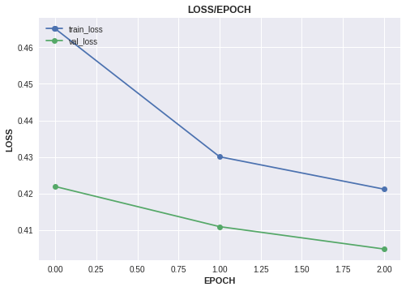
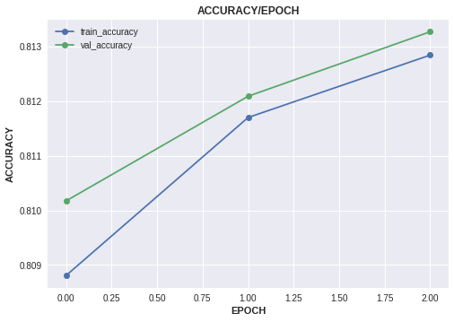
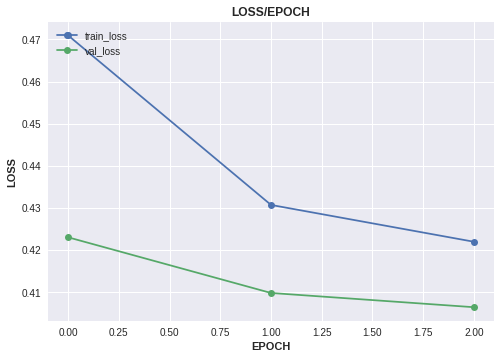
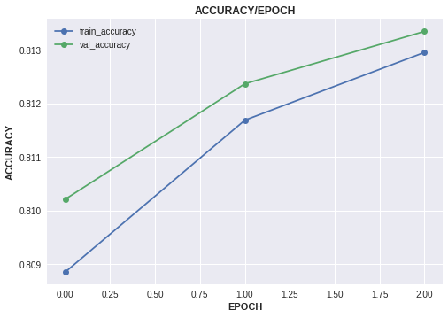
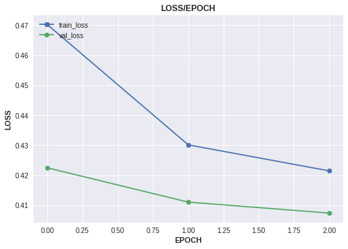
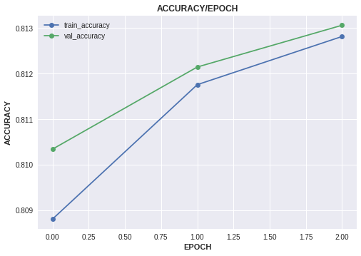

# Classification on Tabular Data

* Dataset: <https://www.kaggle.com/c/cat-in-the-dat-ii>
* We will learn how to perform CrossValidation with torchflare.

***
#### Importing Libraries
``` python
import numpy as np
import pandas as pd
from sklearn.preprocessing import LabelEncoder
from sklearn.model_selection import train_test_split

import torch
import torch.nn as nn
import torch.nn.functional as F
from torch.utils.data import Dataset, DataLoader

import os
import copy
import traceback
import datetime
import random

from torchflare.experiments import Experiment
import torchflare.metrics as metrics
import torchflare.callbacks as cbs
import torchflare.criterion as crit
from torchflare.datasets import TabularDataset , CVSplit
```


``` python
%load_ext nb_black
```


#### Reducing memory usage(some typical kaggle stuff).
``` python
def reduce_mem_usage(df, verbose=True):
    '''
    Reduce file memory usage
    Source: https://www.kaggle.com/artgor

    Parameters:
    -----------
    df: DataFrame
        Dataset on which to perform transformation
    verbose: bool
        Print additional information
    Returns:
    --------
    DataFrame
        Dataset as pandas DataFrame
    '''
    numerics = ['int16', 'int32', 'int64', 'float16', 'float32', 'float64']
    start_mem = df.memory_usage().sum() / 1024**2
    for col in df.columns:
        col_type = df[col].dtypes
        if col_type in numerics:
            c_min = df[col].min()
            c_max = df[col].max()
            if str(col_type)[:3] == 'int':
                if c_min > np.iinfo(np.int8).min and c_max < np.iinfo(np.int8).max:
                    df[col] = df[col].astype(np.int8)
                elif c_min > np.iinfo(np.int16).min and c_max < np.iinfo(np.int16).max:
                    df[col] = df[col].astype(np.int16)
                elif c_min > np.iinfo(np.int32).min and c_max < np.iinfo(np.int32).max:
                    df[col] = df[col].astype(np.int32)
                elif c_min > np.iinfo(np.int64).min and c_max < np.iinfo(np.int64).max:
                    df[col] = df[col].astype(np.int64)
            else:
                c_prec = df[col].apply(lambda x: np.finfo(x).precision).max()
                if c_min > np.finfo(np.float16).min and c_max < np.finfo(np.float16)\
                                               .max and c_prec == np.finfo(np.float16).precision:
                    df[col] = df[col].astype(np.float16)
                elif c_min > np.finfo(np.float32).min and c_max < np.finfo(np.float32)\
                                                .max and c_prec == np.finfo(np.float32).precision:
                    df[col] = df[col].astype(np.float32)
                else:
                    df[col] = df[col].astype(np.float64)
    end_mem = df.memory_usage().sum() / 1024**2
    if verbose: print('Mem. usage decreased to {:5.2f} Mb ({:.1f}% reduction)'\
                                               .format(end_mem, 100 * (start_mem - end_mem) / start_mem))

    return (df)

```


#### Reading the data files.

``` python
train_df = pd.read_csv("train.csv")
features = train_df.columns.difference(["id", "target"]).tolist()
target = "target"
```


#### Label Encoding Columns
``` python
label_encoders = {}
for cat_col in features:
    label_encoders[cat_col] = LabelEncoder()
    train_df[cat_col] = label_encoders[cat_col].fit_transform(
        train_df[cat_col].astype("category").cat.codes.fillna(-1).values
    )

train_df = reduce_mem_usage(train_df)
```

    Mem. usage decreased to 19.46 Mb (83.0% reduction)


``` python
cat_dims = [int(train_df[col].nunique()) for col in features]
emb_dims = [(x, min(50, (x + 1) // 2)) for x in cat_dims]
```


#### Defining the Network architecture.
* The network uses concept of [entity embeddings](https://arxiv.org/abs/1604.06737).
``` python
class Model(nn.Module):
    def __init__(
        self, emb_dims, lin_layer_sizes, output_size, emb_dropout, lin_layer_dropouts
    ):
        """
        emb_dims: List of two element tuples
        For each categorical feature the first element of a tuple will
        denote the number of unique values of the categorical
        feature. The second element will denote the embedding
        dimension to be used for that feature.
        """

        super(Model, self).__init__()

        # Embedding layers
        self.emb_layers = nn.ModuleList([nn.Embedding(x, y) for x, y in emb_dims])
        self.no_of_embs = sum([y for x, y in emb_dims])

        # Linear Layers
        first_lin_layer = nn.Linear(
            in_features=self.no_of_embs, out_features=lin_layer_sizes[0]
        )

        self.lin_layers = nn.ModuleList(
            [first_lin_layer]
            + [
                nn.Linear(lin_layer_sizes[i], lin_layer_sizes[i + 1])
                for i in range(len(lin_layer_sizes) - 1)
            ]
        )

        for lin_layer in self.lin_layers:
            nn.init.kaiming_normal_(lin_layer.weight.data)

        # Output Layer
        self.output_layer = nn.Linear(lin_layer_sizes[-1], output_size)
        nn.init.kaiming_normal_(self.output_layer.weight.data)

        # Batch Norm Layers
        self.first_bn_layer = nn.BatchNorm1d(self.no_of_embs)
        self.bn_layers = nn.ModuleList(
            [nn.BatchNorm1d(size) for size in lin_layer_sizes]
        )

        # Dropout Layers
        self.emb_dropout_layer = nn.Dropout(emb_dropout)
        self.droput_layers = nn.ModuleList(
            [nn.Dropout(size) for size in lin_layer_dropouts]
        )

    def forward(self, cat_data):

        if self.no_of_embs != 0:
            x = [
                emb_layer(cat_data[:, i]) for i, emb_layer in enumerate(self.emb_layers)
            ]
            x = torch.cat(x, 1)
            x = self.first_bn_layer(x)
            x = self.emb_dropout_layer(x)

        for lin_layer, dropout_layer, bn_layer in zip(
            self.lin_layers, self.droput_layers, self.bn_layers
        ):

            x = F.relu(lin_layer(x))
            x = dropout_layer(x)
            x = bn_layer(x)

        x = self.output_layer(x)
        return x
```


#### Defining the cross validation strategy and some dataloader params.
* The class CVSplit is used to perform cross validation.
``` python
n_splits = 3
ds = TabularDataset.from_df(df=train_df, feature_cols=features, label_cols=target)


cv = CVSplit(
    dataset=ds, cv="StratifiedKFold", n_splits=n_splits, shuffle=True, random_state=42
)
train_dl_params = {"batch_size": 32, "shuffle": True, "num_workers": 0}
valid_dl_params = {"batch_size": 32, "shuffle": True, "num_workers": 0}
```


#### Running experiment over all folds and visualizing experiment history per fold.
``` python
for fold in range(n_splits):

    print(f"Fold:{fold}")


    # This where you get a train and val dataloaders for a particular fold.
    train_dl, valid_dl = cv.get_loaders(
        fold=fold, train_params=train_dl_params, val_params=valid_dl_params
    )

    metric_list = [metrics.Accuracy(num_classes=2, multilabel=False, threshold=0.6)]

    callbacks = [
        cbs.EarlyStopping(monitor="accuracy", patience=3, mode="max"),
        cbs.ModelCheckpoint(monitor="accuracy", mode="max"),
        cbs.ReduceLROnPlateau(mode="max", patience=2),
    ]

    model = Model(
        emb_dims,
        lin_layer_sizes=[200, 200],
        output_size=1,
        emb_dropout=0.3,
        lin_layer_dropouts=[0.3, 0.3],
    )

    exp = Experiment(
        num_epochs=3,
        save_dir="./models",
        model_name=f"tabular_cls_{fold}.bin",
        fp16=False,
        device="cuda",
        compute_train_metrics=True,
        seed=42,
    )

    exp.compile_experiment(
        model=model,
        optimizer="Adam",
        optimizer_params=dict(lr=3e-4),
        callbacks=callbacks,
        criterion=crit.BCEWithLogitsFlat,
        metrics=metric_list,
        main_metric="accuracy",
    )
    exp.run_experiment(train_dl, valid_dl)
    keys = ["loss", "accuracy"]
    exp.plot_history(keys=keys, save_fig=False, plot_fig=True)
```

    Fold:0

    Epoch: 1/3
    Train: 12500/12500 [=========================]- 82s 7ms/step - train_loss: 0.4651 - train_accuracy: 0.8088
    Valid: 6250/6250 [=========================]- 11s 2ms/step - val_loss: 0.4219 - val_accuracy: 0.8102

    Epoch: 2/3
    Train: 12500/12500 [=========================]- 89s 7ms/step - train_loss: 0.4301 - train_accuracy: 0.8117
    Valid: 6250/6250 [=========================]- 14s 2ms/step - val_loss: 0.4109 - val_accuracy: 0.8121

    Epoch: 3/3
    Train: 12500/12500 [=========================]- 85s 7ms/step - train_loss: 0.4212 - train_accuracy: 0.8128
    Valid: 6250/6250 [=========================]- 11s 2ms/step - val_loss: 0.4048 - val_accuracy: 0.8133








    Fold:1

    Epoch: 1/3
    Train: 12500/12500 [=========================]- 82s 7ms/step - train_loss: 0.4710 - train_accuracy: 0.8088
    Valid: 6250/6250 [=========================]- 11s 2ms/step - val_loss: 0.4230 - val_accuracy: 0.8102

    Epoch: 2/3
    Train: 12500/12500 [=========================]- 84s 7ms/step - train_loss: 0.4307 - train_accuracy: 0.8117
    Valid: 6250/6250 [=========================]- 11s 2ms/step - val_loss: 0.4098 - val_accuracy: 0.8124

    Epoch: 3/3
    Train: 12500/12500 [=========================]- 84s 7ms/step - train_loss: 0.4220 - train_accuracy: 0.8130
    Valid: 6250/6250 [=========================]- 12s 2ms/step - val_loss: 0.4064 - val_accuracy: 0.8133








    Fold:2

    Epoch: 1/3
    Train: 12500/12500 [=========================]- 89s 7ms/step - train_loss: 0.4702 - train_accuracy: 0.8088
    Valid: 6250/6250 [=========================]- 12s 2ms/step - val_loss: 0.4225 - val_accuracy: 0.8103

    Epoch: 2/3
    Train: 12500/12500 [=========================]- 89s 7ms/step - train_loss: 0.4301 - train_accuracy: 0.8118
    Valid: 6250/6250 [=========================]- 12s 2ms/step - val_loss: 0.4111 - val_accuracy: 0.8121

    Epoch: 3/3
    Train: 12500/12500 [=========================]- 91s 7ms/step - train_loss: 0.4215 - train_accuracy: 0.8128
    Valid: 6250/6250 [=========================]- 11s 2ms/step - val_loss: 0.4074 - val_accuracy: 0.8131






