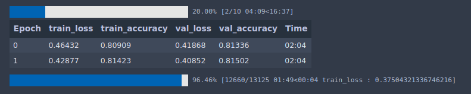

# Classification on Tabular data with torchflare

Let's learn how to perform classification for tasks involving tabular data.

Dataset: <https://www.kaggle.com/c/cat-in-the-dat-ii/overview>

* ### Importing Libraries
``` python
import numpy as np
import pandas as pd
from sklearn.preprocessing import LabelEncoder
from sklearn.model_selection import train_test_split
from sklearn.metrics import roc_auc_score

import torch
import torch.nn as nn
import torch.nn.functional as F
from torch.utils.data import Dataset, DataLoader

import os
import copy
import traceback
import datetime
import random

from torchflare.experiments import Experiment
import torchflare.metrics as metrics
import torchflare.callbacks as cbs
import torchflare.criterion as crit
from torchflare.datasets import SimpleDataloader
```

* ### Some Utility Functions.
``` python
def reduce_mem_usage(df, verbose=True):
    '''
    Reduce file memory usage
    Source: https://www.kaggle.com/artgor

    Parameters:
    -----------
    df: DataFrame
        Dataset on which to perform transformation
    verbose: bool
        Print additional information
    Returns:
    --------
    DataFrame
        Dataset as pandas DataFrame
    '''
    numerics = ['int16', 'int32', 'int64', 'float16', 'float32', 'float64']
    start_mem = df.memory_usage().sum() / 1024**2
    for col in df.columns:
        col_type = df[col].dtypes
        if col_type in numerics:
            c_min = df[col].min()
            c_max = df[col].max()
            if str(col_type)[:3] == 'int':
                if c_min > np.iinfo(np.int8).min and c_max < np.iinfo(np.int8).max:
                    df[col] = df[col].astype(np.int8)
                elif c_min > np.iinfo(np.int16).min and c_max < np.iinfo(np.int16).max:
                    df[col] = df[col].astype(np.int16)
                elif c_min > np.iinfo(np.int32).min and c_max < np.iinfo(np.int32).max:
                    df[col] = df[col].astype(np.int32)
                elif c_min > np.iinfo(np.int64).min and c_max < np.iinfo(np.int64).max:
                    df[col] = df[col].astype(np.int64)
            else:
                c_prec = df[col].apply(lambda x: np.finfo(x).precision).max()
                if c_min > np.finfo(np.float16).min and c_max < np.finfo(np.float16)\
                                               .max and c_prec == np.finfo(np.float16).precision:
                    df[col] = df[col].astype(np.float16)
                elif c_min > np.finfo(np.float32).min and c_max < np.finfo(np.float32)\
                                                .max and c_prec == np.finfo(np.float32).precision:
                    df[col] = df[col].astype(np.float32)
                else:
                    df[col] = df[col].astype(np.float64)
    end_mem = df.memory_usage().sum() / 1024**2
    if verbose: print('Mem. usage decreased to {:5.2f} Mb ({:.1f}% reduction)'\
                                               .format(end_mem, 100 * (start_mem - end_mem) / start_mem))

    return (df)

```

* ### Reading and preprocessing the data
``` python
def perform_label_enc(feature_col , df):
    label_encoders = {}
    for cat_col in feature_col:
        label_encoders[cat_col] = LabelEncoder()
        df[cat_col] = label_encoders[cat_col].fit_transform(
            df[cat_col].astype("category").cat.codes.fillna(-1).values
        )
    return df

train_df = pd.read_csv("./dataset/train.csv")
features = train_df.columns.difference(["id", "target"]).tolist()
target = "target"
train_df = perform_label_enc(feature_col = features , df = train_df)
train_df = reduce_mem_usage(train_df)

cat_dims = [int(train_df[col].nunique()) for col in features]
emb_dims = [(x, min(50, (x + 1) // 2)) for x in cat_dims]

train_df, valid_df = train_test_split(train_df, test_size=0.3, stratify=train_df.target)
```

* ### Defining the Model
``` python
class Model(nn.Module):
    def __init__(
        self, emb_dims, lin_layer_sizes, output_size, emb_dropout, lin_layer_dropouts
    ):
        """
        Model uses entity embeddings.
        Paper: https://arxiv.org/abs/1604.06737

        Args:
            emb_dims: List of two element tuples
            For each categorical feature the first element of a tuple will
            denote the number of unique values of the categorical
            feature. The second element will denote the embedding
            dimension to be used for that feature.
        """
        super(Model, self).__init__()

        # Embedding layers
        self.emb_layers = nn.ModuleList([nn.Embedding(x, y) for x, y in emb_dims])
        self.no_of_embs = sum([y for x, y in emb_dims])

        # Linear Layers
        first_lin_layer = nn.Linear(
            in_features=self.no_of_embs, out_features=lin_layer_sizes[0]
        )

        self.lin_layers = nn.ModuleList(
            [first_lin_layer]
            + [
                nn.Linear(lin_layer_sizes[i], lin_layer_sizes[i + 1])
                for i in range(len(lin_layer_sizes) - 1)
            ]
        )

        for lin_layer in self.lin_layers:
            nn.init.kaiming_normal_(lin_layer.weight.data)

        # Output Layer
        self.output_layer = nn.Linear(lin_layer_sizes[-1], output_size)
        nn.init.kaiming_normal_(self.output_layer.weight.data)

        # Batch Norm Layers
        self.first_bn_layer = nn.BatchNorm1d(self.no_of_embs)
        self.bn_layers = nn.ModuleList(
            [nn.BatchNorm1d(size) for size in lin_layer_sizes]
        )

        # Dropout Layers
        self.emb_dropout_layer = nn.Dropout(emb_dropout)
        self.droput_layers = nn.ModuleList(
            [nn.Dropout(size) for size in lin_layer_dropouts]
        )

    def forward(self, cat_data):

        if self.no_of_embs != 0:
            x = [
                emb_layer(cat_data[:, i]) for i, emb_layer in enumerate(self.emb_layers)
            ]
            x = torch.cat(x, 1)
            x = self.first_bn_layer(x)
            x = self.emb_dropout_layer(x)

        for lin_layer, dropout_layer, bn_layer in zip(
            self.lin_layers, self.droput_layers, self.bn_layers
        ):

            x = F.relu(lin_layer(x))
            x = dropout_layer(x)
            x = bn_layer(x)

        x = self.output_layer(x)
        return x

model = Model(emb_dims, lin_layer_sizes=[300, 300],
                   output_size=1, emb_dropout=0.3,
                   lin_layer_dropouts=[0.3, 0.3])


```

* ### Creating the dataloaders
``` python
train_dl = SimpleDataloader.tabular_data_from_df(df = train_df,
                                                feature_cols = features,
                                                label_cols = target
                                                ).get_loader(batch_size = 32, num_workers = 0,
                                                            shuffle = True)

valid_dl = SimpleDataloader.tabular_data_from_df(df = valid_df,
                                                feature_cols = features,
                                                label_cols = target
                                                ).get_loader(batch_size = 32, num_workers = 0,
                                                            shuffle = False)

```

* ### Defining metrics and callbacks.
``` python
metric_list = [metrics.Accuracy(num_classes=2, multilabel=False, threshold=0.6)]
callbacks = [
    cbs.EarlyStopping(monitor="accuracy", patience=5),
    cbs.ModelCheckpoint(monitor="accuracy"),
]
```

* ### Setting up the Experiment
``` python
exp = Experiment(
    num_epochs=10,
    save_dir="./models",
    model_name="tabular_cls.bin",
    fp16=False,
    using_batch_mixers=False,
    device="cuda",
    compute_train_metrics=True,
    seed=42,
)

exp.compile_experiment(
    model=model,
    optimizer="Adam",
    optimizer_params=dict(lr=3e-4),
    callbacks=callbacks,
    scheduler="ReduceLROnPlateau",
    scheduler_params=dict(mode="max", patience=2),
    criterion=crit.BCEWithLogitsFlat,
    metrics=metric_list,
    main_metric="accuracy",
)

```

* ### Run the experiment.
``` python
exp.run_experiment(train_dl=train_dl, valid_dl=valid_dl)
```

Here is a snapshot of how progress bar looks(Same as fastai, since we are using fastprogess).



* ***[Notebook](/examples/tabular_classification.ipynb) is available in examples folder.***
